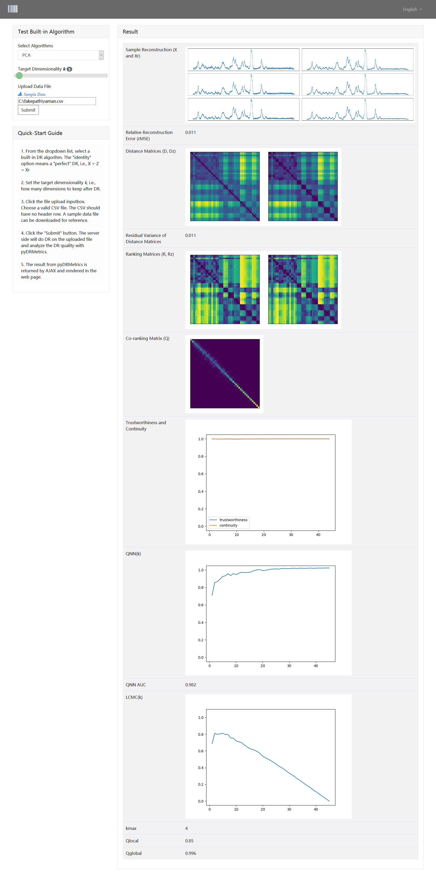

# About

This project is a GUI wrapper for pyDRMetrics:

   pyDRMetrics - A Python toolkit for dimensionality reduction quality assessment, Heliyon, Volume 7, Issue 2, 2021, e06199, ISSN 2405-8440, https://doi.org/10.1016/j.heliyon.2021.e06199.

The original version is developed in ASP.Net MVC (http://qsi.zhangys.org.cn/research/dr/). This project has rewritten it using Flask. 

# Install and Run

1. pip install wDRMetrics
   The package will be installed into USER\anaconda3\Lib\site-packages\wDRMetrics 
2. python -m wDRMetrics.run
3. Go to http://localhost:5006/

# Run directly from source

1. git clone https://github.com/zhangys11/wDRMetrics.git
2. cd wDRMetrics/app/
3. python wDRMetrics.py
4. Go to http://localhost:5006/

# ScreenCut

## Test built-in DR algorithms

## Analyze self-defined DR algorithm
